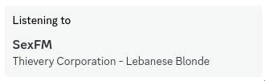

# SexFM discord player (unofficial)

24/7 discord SexFM player

Official SexFM website: [sexfm.live](https://sexfm.live/)

### Bandwidth warning

I would not recommend running this continuously on connections with limited bandwidth.

The bot consistently takes around 140kb/s (inbound) + 120kb/s (outbound),
which roughly equals to **920MB / hour** or **720GB / month**.

## Running

- Install bun from [bun.sh](https://bun.sh)
- Install ffmpeg to your `PATH`
- Create and set up your bot on [discord development console](https://discord.com/developers/)
- Create and configure `.env` (see [.env.example](.env.example))
- Run `bun src/index.ts`

