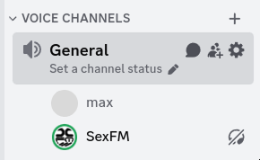

# sexfm discord player (unofficial)

24/7 discord sexfm player

it only plays the music, that's it.

## running

- install bun from [bun.sh](https://bun.sh)
- create and set up your bot on [discord development console](https://discord.com/developers/)
- create and configure `.env` (see [.env.example](.env.example))
- run `bun src/index.ts`

You might need to kill it (`Ctrl+C`) and relaunch if it doesn't work a couple of times.

